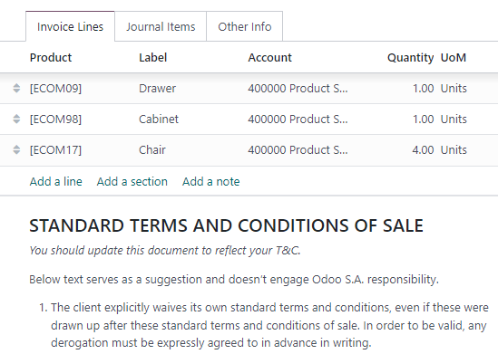
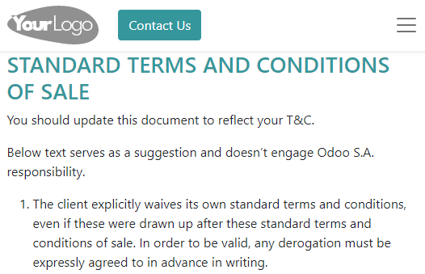

==================================
Default terms and conditions (T&C)
==================================

Add default terms and conditions at the bottom of all customer invoices, sales orders, and
quotations, either as text or a link to a web page.

Configuration
=============

Go to :menuselection:`Accounting --> Configuration --> Settings`. Under the :guilabel:`Customer
Invoices`, enable :guilabel:`Default Terms & Conditions`. By default, the :guilabel:`Add a Note`
option is selected. Enter the terms and conditions in the field below.

Alternatively, to display the terms and conditions on a web page, select the :guilabel:`Add a link
to a Web Page` option and click :guilabel:`Save`. Click :guilabel:`Update Terms`, edit the
content, and click :guilabel:`Save`. The link is then added as a note.

To edit the layout and content of the page using the Website Builder, install the eCommerce app. The
:guilabel:`Edit in Website Builder` option then replaces :guilabel:`Update Terms`.

