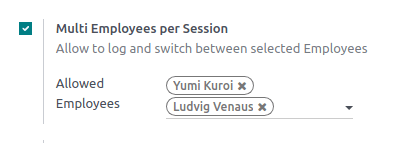
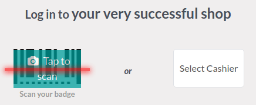
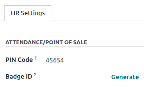

==========================
Multi employees management
==========================

Odoo Point of Sale allows you to manage access to a defined POS through the **Multi Employees per
Session** feature. Once enabled, you can select which individuals can log into the POS and keep
track of the employees involved in each order.

:ref:`To log in <employee_login/use>`, the allowed users can select themselves or scan their badge
ID.

.. _employee_login/configuration:

Configuration
=============

:ref:`Access the POS settings <configuration/settings>` and select your POS, or click the vertical
ellipsis button (:guilabel:`⋮`) on a POS card and click :guilabel:`Edit`. Then, enable
:guilabel:`Multi Employees per Session`, and add the allowed employees in the :guilabel:`Allowed
Employees` field.

.. _employee_login/use:

Practical application
=====================

Once the feature is activated, you must select the cashier :ref:`by scanning their badge
<employee_login/badge>` or choosing from the list of allowed employees when :ref:`opening the
session <pos/session-start>`.

To switch to another user :ref:`from an open session <pos/session-start>`, click the employee name
at the top-right of the screen. Then, select the employee to swap with from the list.

.. image:: employee_login/switch-user.png
   :alt: button to switch from one cashier to another.

You can also attribute a pin code to your employees. When a password is set, they must enter it each
time they log in as a POS user. Doing so prevents people from login as someone else. To do so, go to
the **Employees** app, open the employee form, and enter a pin code of your choice in the
:guilabel:`PIN Code` field of the :guilabel:`Attendance/Point of Sale` category.

.. _employee_login/badge:

Log using badges
----------------

Employees must have a badge ID assigned to log in using a badge. To do so, go to the **Employees**
app, open the employee form, and enter a badge ID of your choice in the :guilabel:`PIN
Code` field of the :guilabel:`Attendance/Point of Sale` category.

To switch to another user, lock the session by clicking the lock-shaped icon (:guilabel:`🔓`) and
scan your badge.

Analytics
=========

Once you close and post the POS session, access the comprehensive report to review all session
activities, including who initiated the session and who handled specific orders. To access the
session's report, click the vertical ellipsis button (:guilabel:`⋮`) on the POS cart and select
:guilabel:`Sessions` from the :guilabel:`View` section. Within the report, select a
specific session for more detailed information, and click the :guilabel:`Orders` button to view a
summary of all orders placed during that session.

To get an overview of all orders, regardless of the session, click the vertical ellipsis
button (:guilabel:`⋮`) on the POS cart and select :guilabel:`Orders` from the View section.
