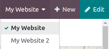

=================
Multiple websites
=================

Odoo allows you to create multiple websites from the same database. This can be useful, for example,
if you have multiple brands operating under your organization, or to create separate websites for
different products or services, or different audiences (e.g. consumers in different geographic
areas). In these cases, having different websites can help avoid confusion and make it easier to
tailor your digital outreach strategies and reach your target audience.

Each website can be designed and configured independently with its own domain name, theme, pages,
menus, languages, products, assigned sales team, etc. However, they can also share contents and
pages.

Website creation
================

To create a new website, proceed as follows:

#. Go to :menuselection:`Website --> Configuration --> Settings`.
#. Click :guilabel:`+ New Website`.

   .. image:: multi_website/create-website.png
      :align: left

#. Specify the :guilabel:`Website Name` and :guilabel:`Website domain`. Leave the :guilabel:`Website
   domain` field empty to publish the new website under the :doc:`default domain
   <domain_names>`.
#. Adapt the :guilabel:`Company name`, :guilabel:`Languages` and :guilabel:`Default language`
   if needed.
#. Click the :guilabel:`Create` button.

You can then start building your new website.

.. note::

   By default, all website-related apps/modules that you have installed (e.g. eCommerce, forum,
   blog, etc.) and their related pages (e.g. Shop) are also available on the new website. You can
   remove them by amending the menu.

Switch between websites
=======================

To switch from one website to another, click the menu next to the :guilabel:`+New` button in the
upper right corner and select the website you want to switch to.

.. note::
   When you switch websites, you are redirected to the other website, to the same URL as the current
   one. If this URL has not been defined, you are redirected to a 404 page. You can create the page
   from there:

   add screenshot

Website-specific configuration
==============================

Most website settings are website-specific, which means they can be enabled/disabled per website. To
adapt the settings for a given website, select the website in the field :guilabel:`Settings of
Website`, then adapt the options as desired.
(add screenshot)

.. note::
   Websites are created with the default settings; the settings are not copied from one website to
   the other.

Website-specific content
========================

By default, pages, products, blog posts, event, etc. created from the frontend using the
:guilabel: `+New` button are only available on the website from which it was created. This can be
changed in the backend (e.g. in the product form), in the :guilabel:`Website` field.

.. image::
   :align: left

On the other hand, records created from the backend are made available on all websites by default.

Website pages
-------------

To modify the website on which a page is to be published, proceed as follows:

#. Go to :menuselection:`Website --> Site --> Pages`.
#. Tick the check box next to the page(s) you want to change.
#. Click the :guilabel:`Website` field and select the website, or empty it to publish the page on
   all websites.

When you edit a page, the changes only affect the current website.
When you duplicate a page and link it to a specific website, the original page is still linked to
all websites.

You can group pages by URL in the page manager to quickly identify the original page behind the new
one.

.. note::
   Homepages are required for every website on the database; you may not use the same homepage for
   several websites.

.. tip::
   Make sure your websites don’t have too many pages in common as this can have a negative impact on
   SEO for example.

eCommerce features
------------------

Features such as products, eCommerce categories, pricelists, discounts, payment providers, etc. can
be made available:

- On all websites: leave the :guilabel:`Website` field empty
- Only on one website: set the :guilabel:`Website` field accordingly
- On some websites: in this case, you should duplicate the item and set the :guilabel:`Website`
  field.

add screenshot of product with ecommerce tab

Customer accounts
~~~~~~~~~~~~~~~~~

You can allow your customers to use the same :doc:`account
<../../ecommerce/ecommerce_management/customer_accounts>`on all of your websites by enabling the
:guilabel:`Shared Customer Accounts` check box in the :doc:`website settings <../configuration>`.

Pricing
~~~~~~~

Products can be priced differently based on the website using :doc:`pricelists
<../../../sales/products_prices/prices/pricing>`. The following configuration is required:

#. Go to :menuselection:`Website --> Configuration --> Settings`.
#. Scroll down to the :guilabel:`Shop - Products` section and select the :guilabel:`Pricelists`
   option :guilabel:`Multiple prices per product`.
#. Click :guilabel:`Pricelists` to :doc:`define new pricelists or edit existing ones.
#. Select the pricelist or click :guilabel:`New` to create a new one, then select the
   :guilabel:`Configuration` tab and set the :guilabel:`Website`field.

Multi-companies
---------------

In a :doc:`multi-company environment < ../../../../general/users/companies>`, each website can be
linked to a specific company in your database.
(add screenshot)

This allows to only display company-related data on the website (e.g. products, jobs, events, etc.).

.. note::
   If websites are multi-companies, you don’t change company when switching websites. To change the
   company and see the related content, use the company selector in the menu.

Website-specific reporting
==========================

Analytics
~~~~~~~~~

Each website has its own :doc:`analytics <../reporting/plausible>`. To switch between websites,
click the buttons in the upper right corner:

(adds screenshot)

eCommerce dashboard, online sales and visitors
~~~~~~~~~~~~~~~~~~~~~~~~~~~~~~~~~~~~~~~~~~~~~~

Select Group by → Website

Technical hints for customization
=================================

If you want to publish custom objects on the website, here are a few
tips to make it work with multi websites:

-  Sitemap: don’t forget the domain in the route to only publish
       available records in each website’s sitemap.

-  Access: you should call the method
       *can_access_from_current_website* in the controller to make
       sure the visitor can see a record in the current website.

-  Search: when a list of records is displayed, don’t forget to specify
       the domain to only display records available for the current
       website.

.. image:: multi_website/multi_website11.png
  :align: center
